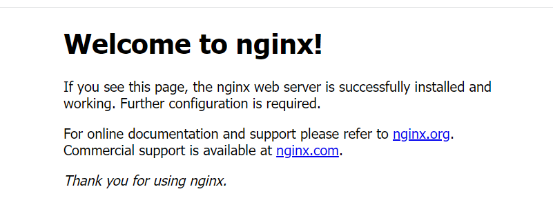
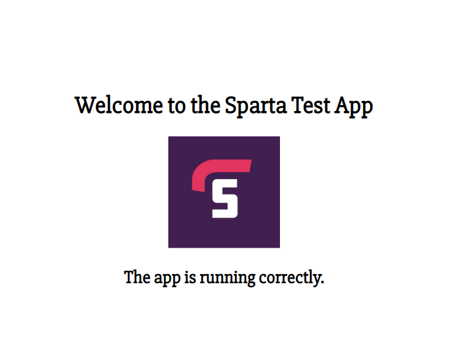

# How to provision step by step

# Step 1
 Create a provision.sh file in the same directory as your Vagrantfile

# Step 2
In the provison.sh file type up the following code

```
#!/bin/bash


# Update and upgrade
sudo apt-get update -y
sudo apt-get upgrade -y

# Install nginx
sudo apt-get install nginx -y

# Enable or Start Nginx
sudo systemctl enable nginx -y
```

# Step 3
Go on Git bash and cd into vagrant file

# Step 4 
Type the following in gitbash
```
vagrant up
vagrant ssh
```
# Step 5
Once you complete step 4 type 

```
cd app 
cd app
npm install 
Node app.js
```

# Step 6
Once this has been compleated go on google ans test it by typing 
```
192.168.10.100
```




# Step 7
To run 192.168.10.100:3000

go on the url and type 192.168.10.100:3000 you should get the following





