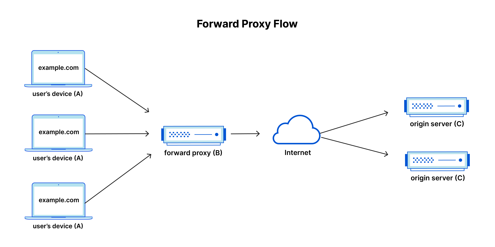

# Nginx reverse proxy

# What are ports?
A port is a virtual point where network connections start and end. Ports are software-based and managed by a computer's operating system. Each port is associated with a specific process or service.Ports allow computers to easily differentiate between different kinds of traffic: emails go to a different port than webpages, for instance, even though both reach a computer over the same Internet connection.


# What is a reverse proxy? How is it different to a proxy?

A reverse proxy is a server that sits in front of web servers and forwards client. Reverse proxies are typically implemented to help increase security, performance, and reliability.A forward proxy, often called a proxy, proxy server, or web proxy, is a server that sits in front of a group of client machines. When those computers make requests to sites and services on the Internet, the proxy server intercepts those requests and then communicates with web servers on behalf of those clients.



# What is Nginx's default configuration

```
server {
        listen 80 default_server;
        listen [::]:80 default_server;

        root /var/www/html;

        servername ;

        location / {
                try_files $uri $uri/ =404;
        }
}
```

# How do you set up a Nginx reverse proxy?

### Step 1
Install Nginx using the following commands

```
sudo apt-get update
sudo apt-get install nginx
```

### Step 2
Disable the Default Virtual Host by using the following command

```
sudo unlink /etc/nginx/sites-enabled/default
```

### Step 3
Create the Nginx Reverse Proxy

After disabling the virtual host, we need to create a file called reverse-proxy.conf within the etc/nginx/sites-available directory to keep reverse proxy information. Use the following command to accessthe directory
```
cd etc/nginx/sites-available/
```

Then we can create the file using the vi editor
```
vi reverse-proxy.conf
```

Put the following string inside the file
```
server {
    listen 80;
    location / {
        proxy_pass http://192.x.x.2;
    }
}
```

Once completed, simply save the file and exit the vi editor. You can do this by keying in :wq.

To pass information to other servers, you can use the ngx_http_proxy_module in the terminal.

activate the directives by linking to /sites-enabled/ using the following command

```
sudo ln -s /etc/nginx/sites-available/reverse-proxy.conf /etc/nginx/sites-enabled/reverse-proxy.conf
```

### Step 4
Now we need to test Nginx and the Nginx Reverse Proxy type the following command in a linux terminal

```
service nginx configtest
service nginx restart
```


